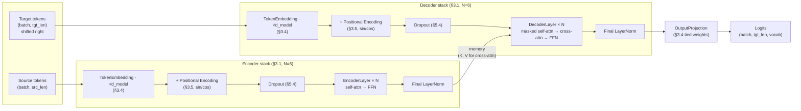
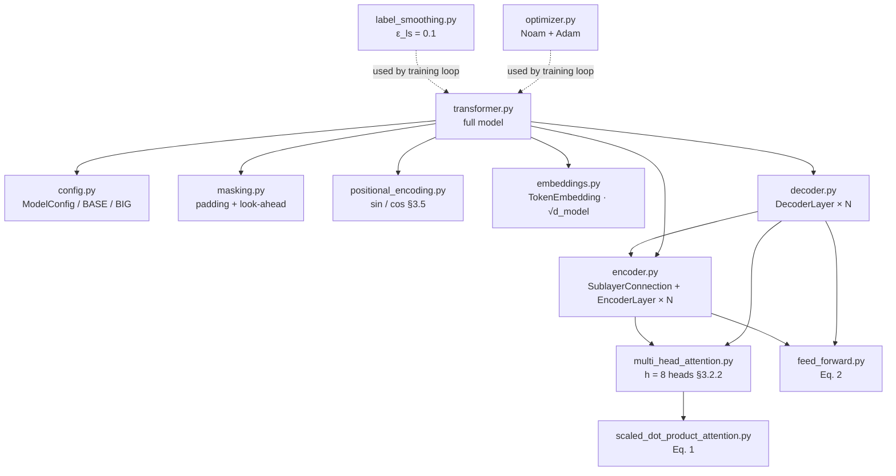
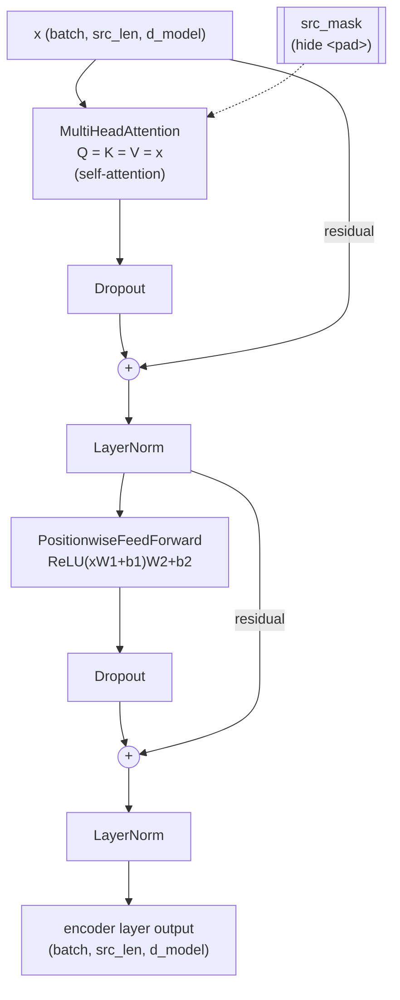
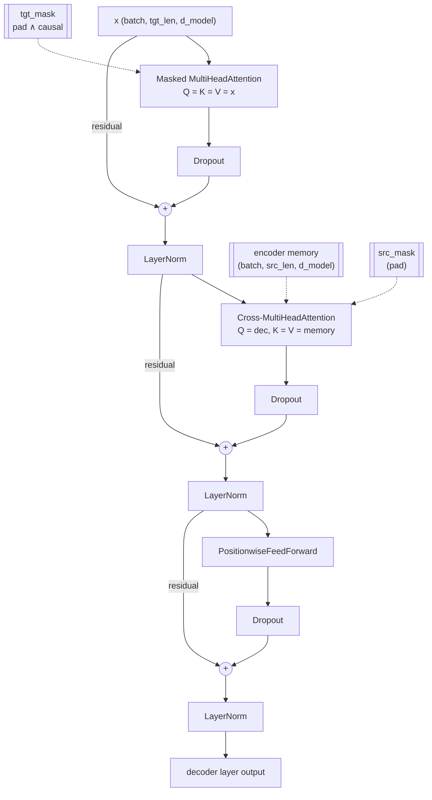
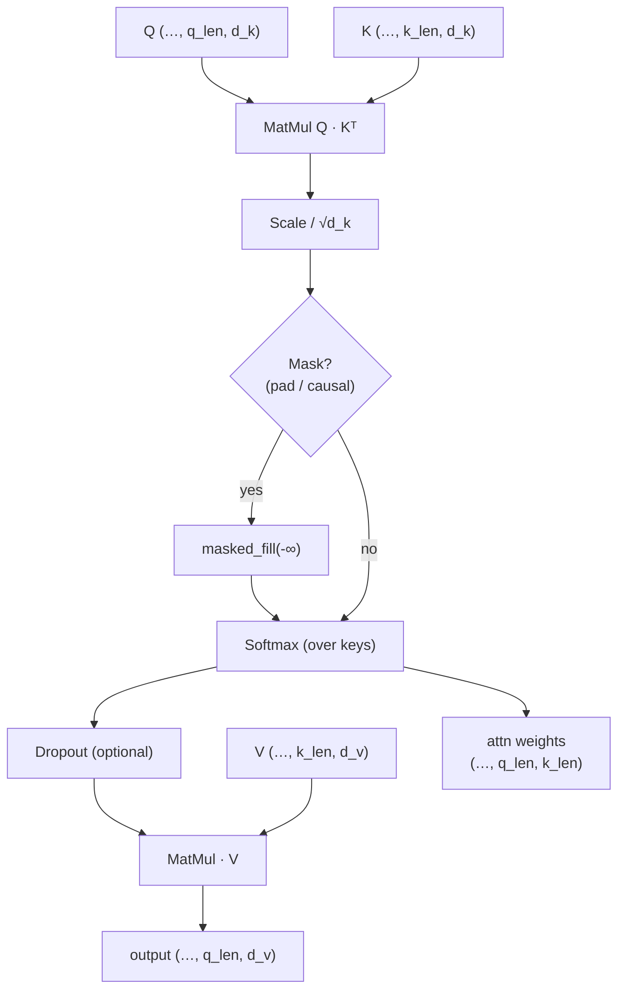
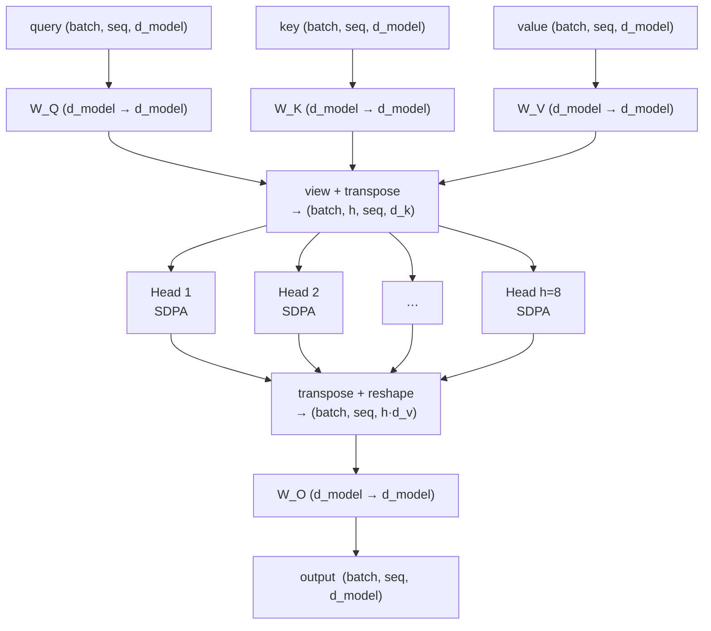
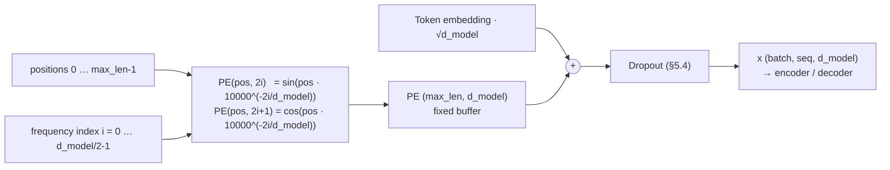
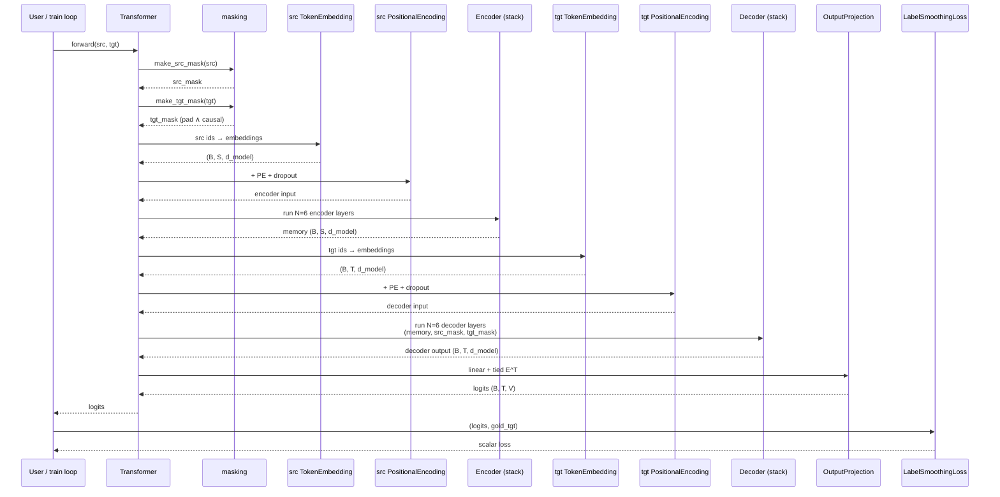
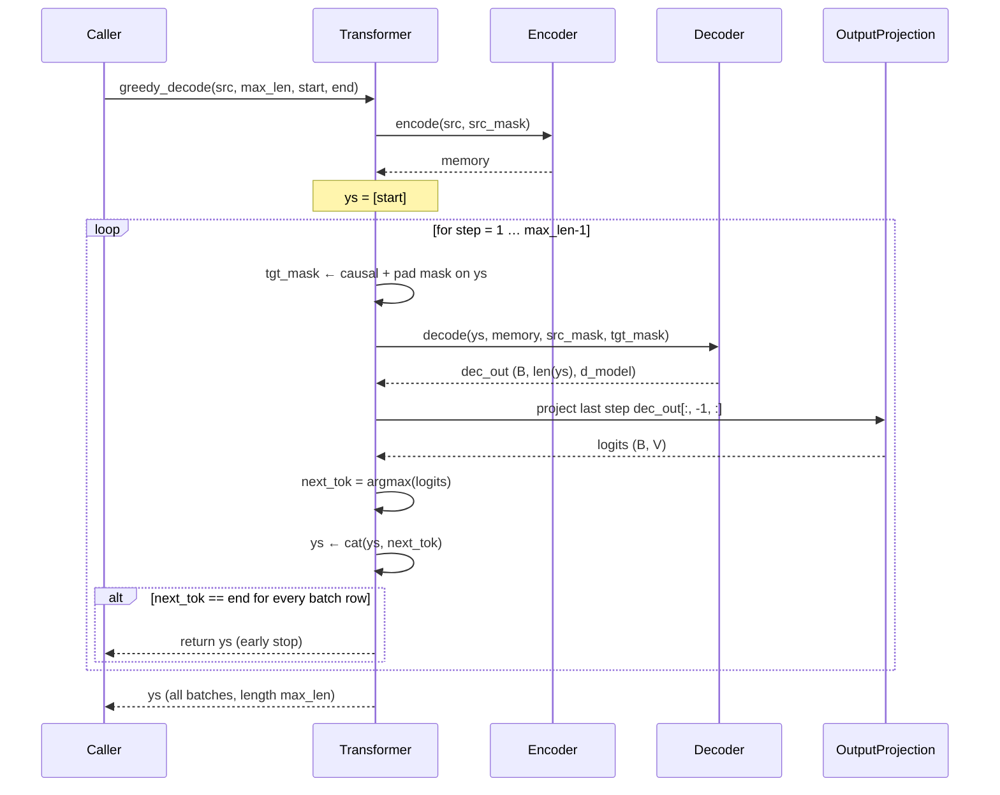

# ATransformer — "Attention Is All You Need" from Scratch

A didactic, line-by-line implementation of the Transformer described in:

> Vaswani, A., Shazeer, N., Parmar, N., Uszkoreit, J., Jones, L., Gomez, A. N.,
> Kaiser, Ł., & Polosukhin, I. (2017).
> **Attention Is All You Need.**
> In *Advances in Neural Information Processing Systems 30 (NIPS 2017)*.
> arXiv:1706.03762.

Every module, function, and *almost every line* of Python is tied back to a concrete
sentence, equation, table, or figure in the paper. This project is intended for a
bachelor-level student who wants to walk through the paper with working code in hand.

The original paper PDF is shipped with the repo at
[`docs/attention_is_all_you_need.pdf`](docs/attention_is_all_you_need.pdf) — read it
side-by-side with the diagrams below.

---

## 1. How the code maps to the paper

| Paper section / item                                | Code file                                      |
| --------------------------------------------------- | ---------------------------------------------- |
| §3 "Model Architecture" (Fig. 1 overview)           | `src/transformer.py`                           |
| §3.1 "Encoder and Decoder Stacks" — encoder         | `src/encoder.py`                               |
| §3.1 "Encoder and Decoder Stacks" — decoder         | `src/decoder.py`                               |
| §3.2.1 "Scaled Dot-Product Attention" (Eq. 1)       | `src/scaled_dot_product_attention.py`          |
| §3.2.2 "Multi-Head Attention"                       | `src/multi_head_attention.py`                  |
| §3.2.3 "Applications of Attention in our Model"     | `src/transformer.py` (how Q,K,V are wired)     |
| §3.3 "Position-wise Feed-Forward Networks" (Eq. 2)  | `src/feed_forward.py`                          |
| §3.4 "Embeddings and Softmax"                       | `src/embeddings.py`                            |
| §3.5 "Positional Encoding" (sin/cos formulas)       | `src/positional_encoding.py`                   |
| Padding + subsequent-token mask (§3.2.3)            | `src/masking.py`                               |
| §5.3 "Optimizer" (Eq. 3, Noam schedule)             | `src/optimizer.py`                             |
| §5.4 "Regularization" — Residual Dropout            | Inside encoder/decoder sublayers               |
| §5.4 "Regularization" — Label Smoothing (ε_ls=0.1)  | `src/label_smoothing.py`                       |
| Table 3 hyper-parameters (base & big)               | `src/config.py`                                |

The long-form paper-to-code correspondence is in `docs/paper_mapping.md`.

---

## 2. Visual architecture

This section is the graphical companion to the paper. Every diagram is drawn in
Mermaid (rendered natively on GitHub / most Markdown viewers) or ASCII so that
nothing has to be built or fetched to read it.

### 2.1 High-level model — paper Fig. 1 redrawn

The full encoder–decoder model implemented by `src/transformer.py`. Compare it
directly with Figure 1 of the paper.



### 2.2 Module dependency graph

How the Python files import each other (roughly bottom-up — the arrow means
"depends on").



### 2.3 Encoder layer internals — `EncoderLayer.forward`

Two sub-layers, each wrapped in `LayerNorm(x + Dropout(Sublayer(x)))`
(§3.1 + §5.4).



### 2.4 Decoder layer internals — `DecoderLayer.forward`

Three sub-layers: masked self-attention, cross-attention to encoder `memory`,
then FFN (§3.1, §3.2.3).



### 2.5 Scaled Dot-Product Attention — Fig. 2 left (Eq. 1)

Implemented by `scaled_dot_product_attention` in
`src/scaled_dot_product_attention.py`.



`Attention(Q, K, V) = softmax(Q Kᵀ / √d_k) V`

### 2.6 Multi-Head Attention — Fig. 2 right (§3.2.2)

`MultiHeadAttention` in `src/multi_head_attention.py`.



`MultiHead(Q, K, V) = Concat(head_1, …, head_h) · W^O` with
`h = 8`, `d_k = d_v = d_model / h = 64`.

### 2.7 Positional encoding — §3.5

Deterministic sinusoidal matrix added to the embeddings in
`src/positional_encoding.py`.



See `examples/positional_encoding.png` for the heat-map generated by
`examples/01_positional_encoding_demo.py`.

### 2.8 Attention masks — §3.1 + §3.2.3

Two complementary masks; the decoder self-attention uses the **AND** of both.

```
Padding mask (hide <pad>):                Causal / look-ahead mask (lower-triangular):

  key idx  →   t0  t1  t2  pad pad             key idx  →   t0  t1  t2  t3  t4
  q t0          ●   ●   ●   .   .              q t0          ●   .   .   .   .
  q t1          ●   ●   ●   .   .              q t1          ●   ●   .   .   .
  q t2          ●   ●   ●   .   .              q t2          ●   ●   ●   .   .
  q pad         ●   ●   ●   .   .              q t3          ●   ●   ●   ●   .
  q pad         ●   ●   ●   .   .              q t4          ●   ●   ●   ●   ●

                                              Decoder self-attn mask = padding AND causal
                                              (● = allowed, . = set pre-softmax to −∞)
```

Code: `padding_mask`, `subsequent_mask`, `make_src_mask`, `make_tgt_mask`
in `src/masking.py`.

### 2.9 Tensor shapes — end-to-end

Every shape change from raw token ids to logits, for one training step.

```
src tokens           (B, S)           LongTensor
                     └─ TokenEmbedding ·√d_model ─┐
                                                  ▼
src embeddings       (B, S, d_model=512)
                     └─ + PE + Dropout ──────────┐
                                                  ▼
encoder input        (B, S, 512)
                     └─ EncoderLayer × N=6 ──────┐
                                                  ▼
memory               (B, S, 512)                  (keys / values for cross-attn)

tgt tokens           (B, T)           LongTensor (shifted right)
                     └─ TokenEmbedding ·√d_model + PE + Dropout ─┐
                                                                  ▼
decoder input        (B, T, 512)
                     ├─ Masked self-attn      (tgt_mask)          │
                     ├─ Cross-attn(memory)    (src_mask)          │
                     └─ FFN                                        │
                     × N=6 layers                                  ▼
decoder output       (B, T, 512)
                     └─ OutputProjection (tied E^T) ─────────────┐
                                                                  ▼
logits               (B, T, V=vocab)
                     └─ LabelSmoothingLoss (or argmax at eval) ─┐
                                                                 ▼
                                                        scalar loss / next tokens

Per-head attention tensors inside MultiHeadAttention:
    Q, K, V    : (B, h=8, *_len, d_k=64)
    scores     : (B, h, q_len, k_len)
    attn (soft): (B, h, q_len, k_len)
    head_out   : (B, h, q_len, d_v=64)
    merged     : (B, q_len, d_model=512)
```

### 2.10 Training forward pass — sequence diagram

How control and tensors flow through one `Transformer.forward(src, tgt)` call
during training.



### 2.11 Inference — greedy decoding sequence diagram

`Transformer.greedy_decode` grows the target sequence one token at a time.



### 2.12 Noam learning-rate schedule — §5.3 Eq. (3)

`NoamScheduler` in `src/optimizer.py`:

```
lrate(step) = d_model^(-0.5) · min(step^(-0.5), step · warmup^(-1.5))
```

```
lrate
  │                ╱‾‾‾‾‾‾‾‾‾‾‾‾─────────________
  │              ╱        peak at step = warmup
  │            ╱          = d_model^-0.5 · warmup^-0.5
  │          ╱                 │
  │        ╱                   │ then decays
  │      ╱  linear warmup      │ ∝ 1 / √step
  │    ╱    ∝ step             │
  │  ╱                         │
  │╱                           ▼
  └────────────────────────────┼─────────────── step
  0                         warmup (4000)
```

Plot produced for real by `examples/08_learning_rate_schedule_demo.py`
(`examples/noam_schedule.png`).

### 2.13 Label smoothing — §5.4 (ε_ls = 0.1)

`LabelSmoothingLoss` turns a one-hot target into a soft distribution `q`.

```
one-hot target (V = 6, true = 2, pad = 0):

  token id :  0(pad)  1     2(true)  3     4     5
  p(target):    0.0   0.0    1.0    0.0   0.0   0.0

label-smoothed target q  (ε_ls = 0.1):

  token id :  0(pad)  1      2(true)   3      4      5
  q        :  0.000  0.025   0.900   0.025  0.025  0.025
              ▲       └────┬─────────────────────────┘
              pad always 0  mass ε_ls/(V−2) on each "other" token
                            mass 1 − ε_ls on the true token

loss = KL( q || softmax(logits) )   summed over non-pad tokens
```

---

## 3. Project layout

```
ATransformer/
├── README.md                                 ← this file
├── requirements.txt                          ← PyTorch + numpy + matplotlib
├── docs/
│   ├── attention_is_all_you_need.pdf         ← original paper (arXiv:1706.03762)
│   └── paper_mapping.md                      ← detailed paper → code mapping, quote by quote
├── src/
│   ├── __init__.py
│   ├── config.py                             ← Table 3 base / big hyperparameters
│   ├── masking.py                            ← padding + look-ahead masks  (§3.2.3)
│   ├── positional_encoding.py                ← §3.5, sin/cos formulas
│   ├── embeddings.py                         ← §3.4 shared input/output embeddings
│   ├── scaled_dot_product_attention.py       ← §3.2.1, Eq. (1)
│   ├── multi_head_attention.py               ← §3.2.2, 8 parallel heads
│   ├── feed_forward.py                       ← §3.3, Eq. (2)
│   ├── encoder.py                            ← §3.1 encoder layer + stack of N=6
│   ├── decoder.py                            ← §3.1 decoder layer + stack of N=6
│   ├── transformer.py                        ← full model (Fig. 1 of the paper)
│   ├── label_smoothing.py                    ← §5.4, ε_ls = 0.1
│   └── optimizer.py                          ← §5.3, Eq. (3), Adam β1=0.9, β2=0.98, ε=1e-9
├── examples/
│   ├── 01_positional_encoding_demo.py
│   ├── 02_scaled_dot_product_attention_demo.py
│   ├── 03_multi_head_attention_demo.py
│   ├── 04_feed_forward_demo.py
│   ├── 05_masking_demo.py
│   ├── 06_encoder_decoder_demo.py
│   ├── 07_full_transformer_demo.py
│   ├── 08_learning_rate_schedule_demo.py
│   ├── 09_label_smoothing_demo.py
│   └── 10_toy_copy_training.py
└── tests/
    └── test_components.py                    ← shape / sanity checks for every module
```

---

## 4. Getting started

```bash
# 1. Install dependencies (Python 3.9+ recommended)
pip install -r requirements.txt

# 2. Walk through the paper with runnable demos:
python examples/01_positional_encoding_demo.py
python examples/02_scaled_dot_product_attention_demo.py
python examples/03_multi_head_attention_demo.py
python examples/04_feed_forward_demo.py
python examples/05_masking_demo.py
python examples/06_encoder_decoder_demo.py
python examples/07_full_transformer_demo.py
python examples/08_learning_rate_schedule_demo.py
python examples/09_label_smoothing_demo.py

# 3. Train a tiny Transformer on a toy "copy the sequence" task
python examples/10_toy_copy_training.py

# 4. Run the shape / sanity tests
python -m tests.test_components
```

---

## 5. Reading order for a bachelor student

1. **README.md** (you are here) — paper → code cheat sheet + visual architecture.
2. **docs/attention_is_all_you_need.pdf** — the paper itself, kept in the repo.
3. **docs/paper_mapping.md** — quoted sentences with links to code.
4. **src/positional_encoding.py** — easiest to grasp: a matrix of sines and cosines.
5. **src/scaled_dot_product_attention.py** — Eq. (1), the heart of the paper.
6. **src/multi_head_attention.py** — how we stack `h = 8` attention heads.
7. **src/feed_forward.py** — the tiny 2-layer MLP in Eq. (2).
8. **src/encoder.py** / **src/decoder.py** — how Fig. 1 is assembled.
9. **src/transformer.py** — the complete model.
10. **src/optimizer.py** + **src/label_smoothing.py** — training tricks from §5.3–§5.4.
11. **examples/** — run them in order to see every idea in action.

Every file has a header that quotes the exact sentence(s) from the paper it
implements, and every line has an inline `# paper: …` comment pointing back to
a specific place in the paper.
